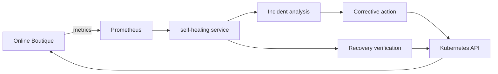
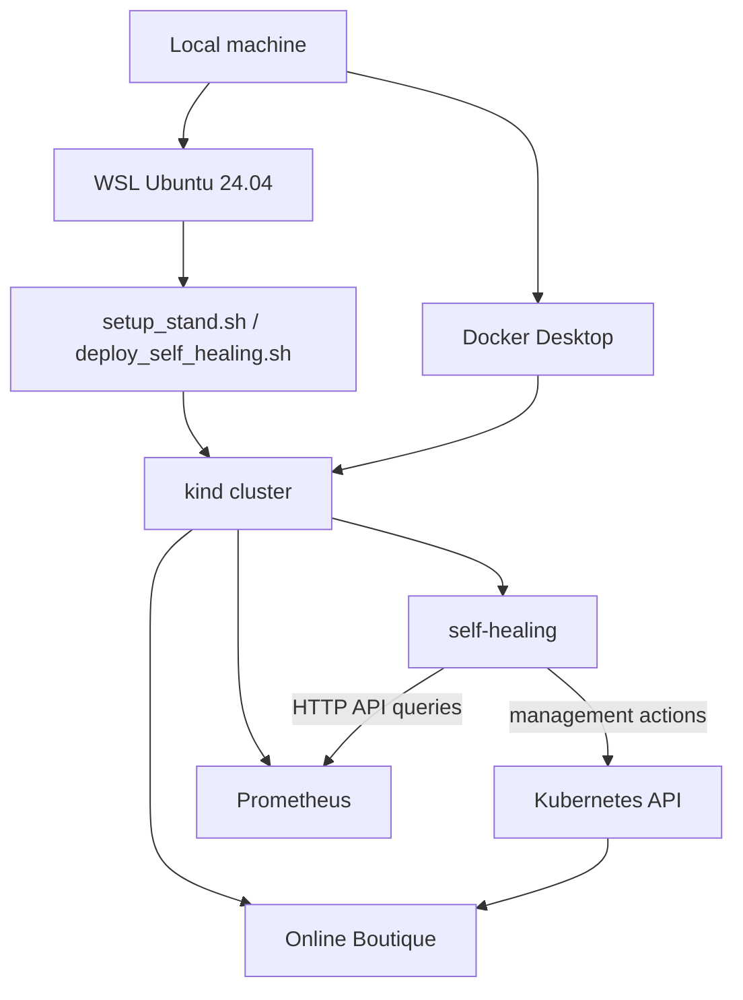

<div align="center">

# Self-Healing Service for Kubernetes Microservices

<p>
  
  
  
  
  
</p>

<p><b>Rule-based incident detection and recovery for a Kubernetes microservice application</b></p>

</div>

Прототип сервиса автоматического реагирования на инциденты для микросервисного приложения в среде Kubernetes. Решение реализовано как отдельный Python-сервис, который опрашивает Prometheus, анализирует диагностические признаки инцидента, выбирает корректирующее воздействие и проверяет факт восстановления через Kubernetes API.

В качестве исследовательского стенда используется приложение Online Boutique, развертываемое в локальном кластере `kind`. В текущем прототипе сервис работает с одним целевым сервисом за один прогон и поддерживает два подтвержденных сценария восстановления: `service_unavailable -> scale_deployment` и `pod_restarting -> delete_pod`.

## Overview

- Отдельный `self-healing` сервис для Kubernetes-ориентированного приложения
- Мониторинг через `Prometheus HTTP API`
- Управляющие действия через `Kubernetes API`
- Воспроизводимый локальный стенд на базе `kind`
- Основной сценарий запуска на Windows через `WSL Ubuntu 24.04`

## Why This Project

Проект показывает, как поверх встроенных механизмов Kubernetes можно построить внешний управляющий слой, который:
- интерпретирует диагностические признаки инцидента;
- выбирает тип corrective action в зависимости от сценария;
- подтверждает не просто выполнение действия, а факт восстановления.

## System Architecture



Сервис реализует цикл:
- сбор диагностических метрик из Prometheus;
- rule-based анализ состояния целевого сервиса;
- выбор corrective action;
- выполнение действия через Kubernetes API;
- повторная проверка восстановления.

## Research Stand



Стенд включает:
- локальный кластер `kind`;
- микросервисное приложение `Online Boutique`;
- систему мониторинга `Prometheus`;
- `self-healing` сервис, развернутый отдельным `Deployment`.

## Repository Scope

В README отражены только файлы, относящиеся к сервису и его инфраструктуре.

```text
services/
  self_healing/
    app/
      analyzer.py
      executor.py
      k8s_client.py
      main.py
      monitoring.py
    tests/
    dockerfile

infra/
  k8s/
    self-healing.yaml

scripts/
  setup_stand.sh
  deploy_self_healing.sh

demo stend/
  microservices-demo-main/
```

## Service Logic

Ключевые модули:
- `monitoring.py` — формирование запросов к Prometheus и сбор снимка состояния;
- `analyzer.py` — rule-based интерпретация диагностических признаков;
- `executor.py` — выбор и выполнение corrective action;
- `k8s_client.py` — взаимодействие с Kubernetes API;
- `main.py` — оркестрация цикла `monitoring -> analysis -> action -> verification`.

Текущая конфигурация Kubernetes-манифеста:
- namespace: `default`;
- target service: `frontend`;
- target container: `server`;
- monitoring endpoint: `http://prometheus-server.monitoring.svc.cluster.local`.

Поддерживаемые corrective actions:
- `scale_deployment`;
- `delete_pod`.

## Experimental Methodology

Эксперименты выполнялись на стенде, повторно поднятом через:
- `WSL Ubuntu 24.04`;
- `scripts/setup_stand.sh`;
- `scripts/deploy_self_healing.sh`.

В каждом прогоне фиксировались:
- момент инициирования инцидента;
- момент обнаружения инцидента сервисом;
- момент запуска corrective action;
- момент подтвержденного восстановления;
- `MTTR` как интервал от детекта до подтвержденного восстановления.

## Experimental Results

| Scenario | Corrective action | MTTR, sec | Full recovery interval, sec | Observed effect |
| --- | --- | ---: | ---: | --- |
| `service_unavailable` | `scale_deployment` | 20.030 | 57.465 | Restored `frontend` availability |
| `pod_restarting` | `delete_pod` | 10.029 | 66.523 | Recreated unstable pod and returned it to `Running/Ready` |

Выводы по результатам:
- сервис успешно отрабатывает как нарушение доступности пользовательского компонента, так и локальную нестабильность pod;
- корректирующее действие выбирается в зависимости от типа инцидента;
- восстановление не считается завершенным до внутренней верификации результата.

## Environment Requirements

Для воспроизведения стенда и сервиса необходимы:
- `Docker Desktop`
- `WSL Ubuntu 24.04`
- `docker`
- `kind`
- `kubectl`
- `helm`

## Quick Start

1. Поднять исследовательский стенд:

```bash
bash scripts/setup_stand.sh
```

2. Развернуть `self-healing` сервис:

```bash
bash scripts/deploy_self_healing.sh
```

## Verification

1. Проверить состояние pod:

```bash
kubectl get pods -A
```

2. Проверить rollout сервиса:

```bash
kubectl rollout status deployment/self-healing -n default
```

3. Просмотреть логи сервиса:

```bash
kubectl logs deployment/self-healing -n default -f
```

4. Проверить пользовательский компонент:

```bash
kubectl port-forward service/frontend-external 8080:80
```

После этого приложение будет доступно по адресу:

```text
http://localhost:8080
```

## Running Tests

```bash
cd services/self_healing
python -m unittest discover -s tests
```

## Current Limitations

- сервис работает с одним целевым сервисом за конфигурацию и прогон;
- набор поддерживаемых инцидентов ограничен двумя подтвержденными сценариями;
- стенд ориентирован на локальное воспроизведение, а не на production-среду;
- специальный механизм self-healing для самого управляющего сервиса не реализован, базовое восстановление его pod обеспечивается штатными механизмами Kubernetes.

## Future Work

- расширение анализа на несколько микросервисов приложения;
- интеграция с chaos engineering инструментами для более сложных сценариев отказов;
- перенос решения в облачную Kubernetes-среду;
- развитие rule-based логики в сторону более гибкого policy-driven или AIOps-подхода.
